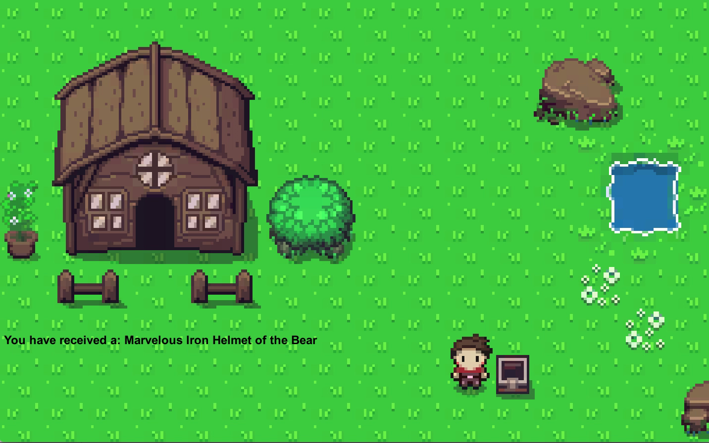

## JRPG Inventory System Sample Game - Generating Items

This is a sample game made to demonstrate the `jrpg-inventory-system` library found at: https://github.com/urbanspr1nter/jrpg-inventory-system.

The purpose of this demo is to:

1. Test the modularity of the library, and effectiveness of its usability.
2. Provide a real-world application of the `ItemGenerator` class found within `jrpg-inventory-system`.

This game is a 2D tile-based JRPG that spawns a **treasure chest** that will constantly drop items. Sometimes, the player will receive an item, sometimes they won't. It just depends on the "random-ness". 

The treasure chest will close upon the player exiting the proximity of it. This will internally spawn a new item for the player to grab.

### Controls

|Key|Description|
|---|-----------|
|W/ArrowUp|Move up|
|S/ArrowDown|Move Down|
|A/ArrowLeft|Move Left|
|D/ArrowRight|Move Right|
|Spacebar|Open treasure chest|

### Download Binaries

The binaries can be downloaded in the releases page. :) 

### Other Stuff

If you like what you see, why not navigate to http://rogerngo.com and read about some of my adventures in learning how to build a game? It would be pretty cool to know there is interest out ther! :D  